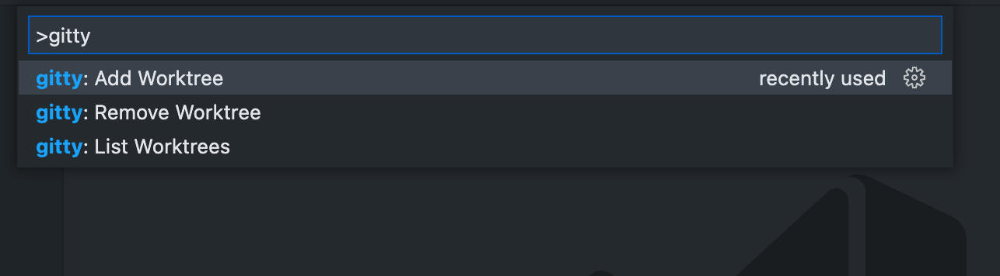

# gitty readme

This is a simple extension for working with worktrees.

## Features

 - Add Worktree
 - Remove Worktree
 - List Worktrees

## Requirements

Only works in git repositories.

## Known Issues

This might be not super user-friendly.

## Release Notes

Users appreciate release notes as you update your extension.

### 1.0.0

Initial release.

-----------------------------------------------------------------------------------------------------------
